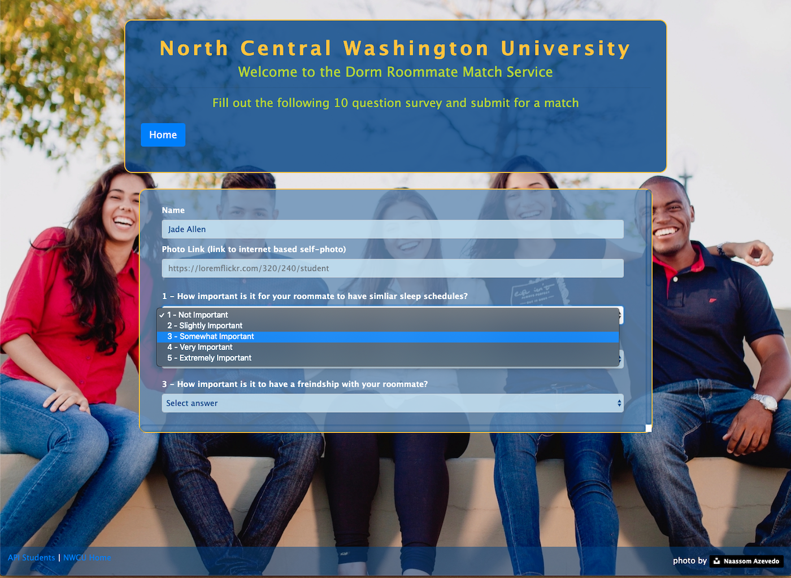
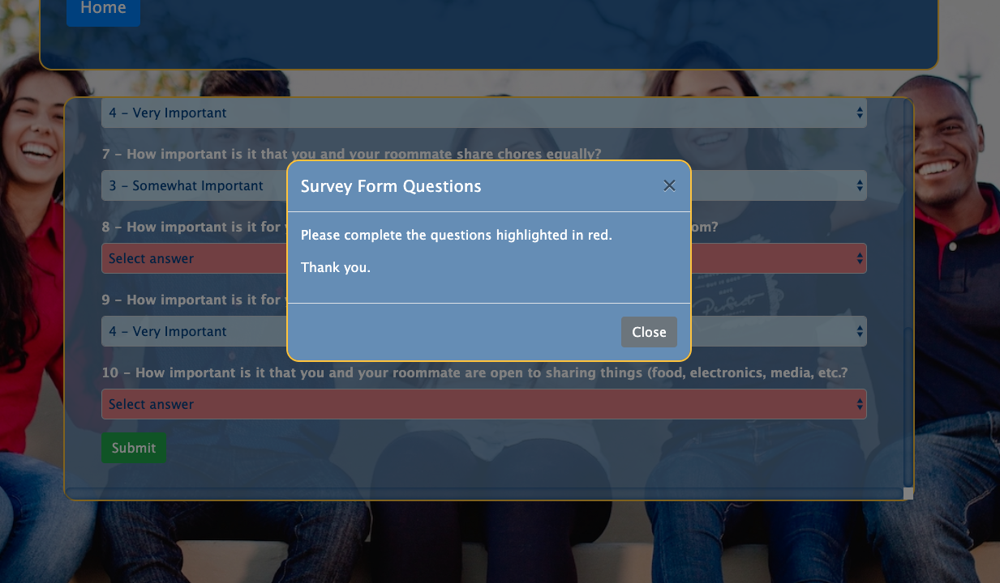
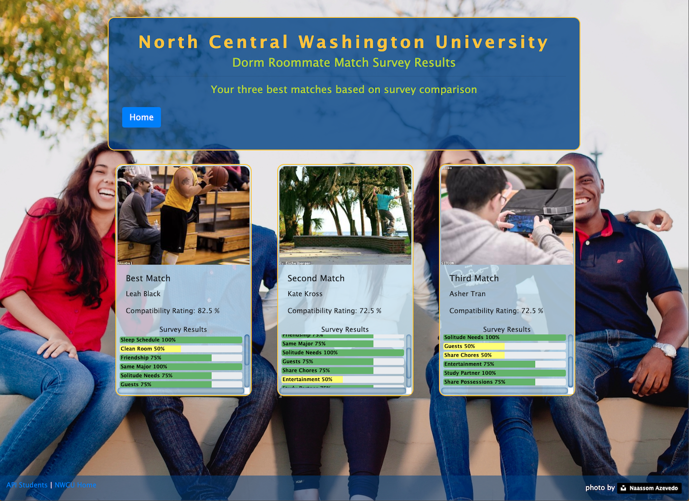

# Dorm Roommate Match

## Full Stack website for finding/matching a compatible dorm roommate

## Description

This full stack web site simulates a college freshman dorm roommate matching service.  The incoming student enters a short profile and answers a 10 question survey on roommate attitudes and considerations.  The student's profile and survey are saved to a mySQL database and compared to the other students.  The top three matches are determined using a simple algorithm comparing answer sets and then displayed for the user.  The site is hosted on Heroku.

- #### Front-End Technology

  - HTML, CSS, JavaScript (ES6 & some OOP), jQuery, Bootstrap, image placeholder generator web site links

  #### Back-End Technology

  - Node.js, Express.js, mySQL, JavaScript (ES6 & some OOP), NPM packages (express, mysql, path), API routes, Heroku

## Details:

- #### Github project :    <a href="https://github.com/mylescarey2019/DormRoommateFinder">Dorm Roommate Match Repository</a>

- #### Deployed Heroku link:  <a href="https://mighty-sands-82826.herokuapp.com">Dorm Roommate Match</a>

- #### For further design and development details see: 

  - #### [UseCases and Psuedo Code](UseCases-PsuedoCode.md)

  - #### [Test Cases](TestCases.md)  

  - #### [Database Schema and SQL Queries](Database-Schema.md)

- #### Demo walkthru GIF : 

  - Use Cases seen in demo below
    - [x] new student enters profile/survey  (validation demonstrated) - gets matches from database
    - [x] new student re-enters profile/survey(changing answers) - gets new matches from database - does not get themselves as a match
    - [x] another new student enter profile/survey with almost identical  answers to above student - gets matches including above student as best match (assuming no other students have been added in the interium with identical answer sets)
    - [x] display of database students in JSON format via /api/get route

#### Screen Captures:

home page

Survey page

Validation example

Results page

## Getting Started

### Native and NPM Packages Used

1. express  - for interactive command line response 
2. mysql - for database connectivity
3. path - for absolute and relative path resolution

### Dependencies

- none - Note:  responsive (but needs a few tweaks) - best viewed at or above 1400x1100

### Installing

- none necessary - use link to page deployed on Heroku

### Executing program

- navigate from home page to survey page
- enter name and link to web based photo if desired (default placeholder link will be used if no link entered)
- answer 10 question survey 
- review results showing top 3 matches
- API/student link will retrieve all database students/survey answers and display in JSON form

#### Possible Enhancements

- [ ] clean up the accuracy of responsiveness 
- [ ] change footer from fixed on viewport to fixed to content
- [ ] more robust user profile with authentication
- [ ] more complex and comprehensive survey and match algorithm

## Authors

Myles Carey 
mylescarey2019@gmail.com 

## Version History

- 1.0 - Initial Release

## License

## Acknowledgments

Thanks to beta testers - my 15yo & 17yo daughters and wife 

Thanks to photograph via unsplash photographers : Master of Shots & Naassom Azevedo

