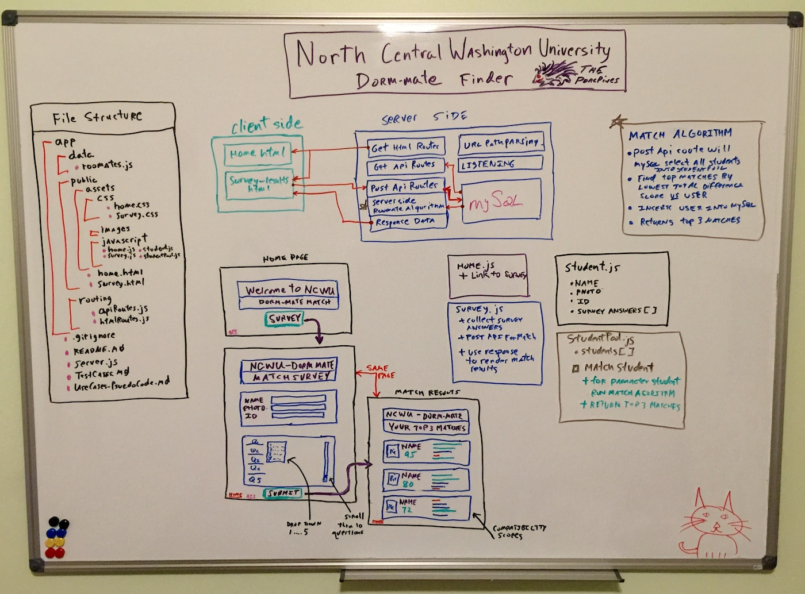

# Dorm Roommate Match

## Full Stack website for finding/matching a compatible dorm roommate

## Description

This full stack application helps a college enrollee find a compatible dorm-mate by comparing their survey results to a pool of other students seeking dorm-mate also.

#### Front-End Technology

- HTML, CSS, JavaScript (ES6 & some OOP), jQuery, Bootstrap, image placeholder generator web site links

#### Back-End Technology

- Node.js, Express.js, mySQL, JavaScript (ES6 & some OOP), NPM packages (express, mysql, path), API routes

## Design Whiteboard

- Entity Data Model:  Student <-- Survey Answers
- modular design with seperate javaScript files for classes, api routes, html routes, html pages

### Database Model

1. Database model consists of student and survey_answer entities 
   - a student  has 0 to many survey_answer rows
   - a survey_answer had 1 student
   - data model is normalized

2. Table Design

- surrogate keys using identity columns are the primary keys for the tables:  student_id and survey_answer_id
- survey_answer table has a question sequence number field:  question_nbr  - this is used when comparing surveys of different students 

#### Application File Structure

​	

## User Stories / Use Cases

1. user starts on home page and clicks link to survey 

   1. survey page loads

2. user starts on homp page and clicks footer link to /api/student 

   1. browser view is shown with formated JSON data for all students & their survey answer sets  

3. user is on survey page - link to home page is clicked

   1. home page loads

4. user is on survey page - clicks submit without completing all questions

   1. modal is shown instructing user to complete missed questions and background of each missed question is changed to rose colored 

5. user completes all survey questions and hits submit

   1. survey is hidden and results are shown

   2. three matches show person's name, picture.  Also shown is a graphic for all 10 questions and the relationship between the user's answer and the answers of the matched person

   3. the total compatibilty is displayed as a percentage of 100% scale - i.e. given there are 10 questions the algorith mis:  100 - (sum of 10 question differences * 2.5)   ex:  if sum of differences is 3 ==>  100 - (3 * 2.5) = 92.5%

   4. under each of the three matches there is a mini-display showing a bargraph for each of the 10 questions.

      1. graph shows question difference represented as % and color

         | Difference in answer between the user and match | %    | color  |
         | ----------------------------------------------- | ---- | ------ |
         | 0                                               | 100  | green  |
         | 1                                               | 75   | green  |
         | 2                                               | 50   | yellow |
         | 3                                               | 25   | yellow |
         | 4                                               | 0    | red    |

         

6. user navigates from home page to survey page again and re-enters a new survey

   1. matching occurs again - if user entered different answers the match results will be different
   2. user will not get themselves as a match
   3. user will not be added to the database a second time, instead their answers and photo link (if changed) will be updated on the database

### Psuedo Code - 

1. classes
   1. student - defines student profile and array of survey answers
      1. has method to compare student compatibility versus another student
   2. studentPool - array of student objects for all students retrieved from database
      1. has method to find 3 matches for user within the whole pool of students
2. routes
   1. hmtl routes for home page and survey page
   2. api routes for students (get) and survey/student (post)
      1. get route :  select all students joined with survey answers from database
         1. denormalize and load to student/studentPool class and return thru API
      2. post route:  select to determine if user already exists in database
         1. insert or update user to the database based on above finding
         2. select all users from database
         3. compute compatibilty of user with each student from database (except themselves)
         4. sort student objects by compatibility and return top 3
3. survey page 
   1. logic to take top 3 returned users from post route and display on survey results
4. home page
   1. link to /api/students route - hits get api routes and loads browser page with JSON formatted data for all student objects